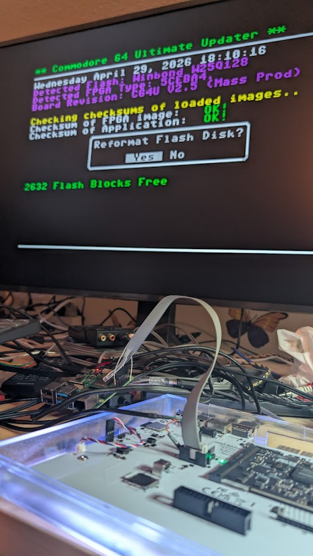
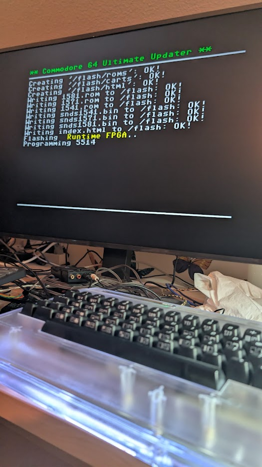
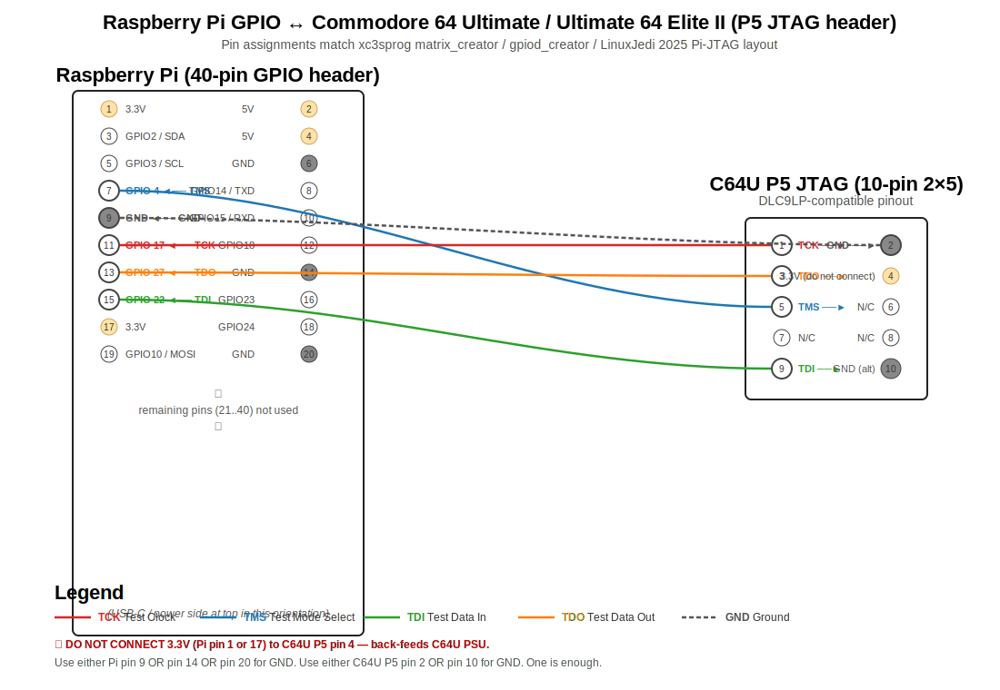
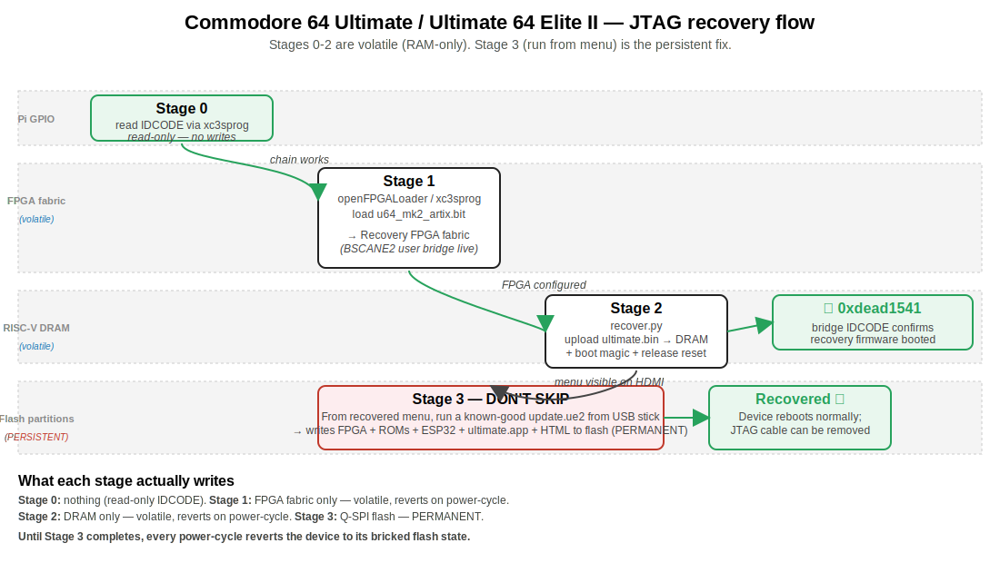

# ultimate64-jtag-recovery-pi

**JTAG recovery for the Commodore 64 Ultimate / Ultimate 64 Elite II hardware family, driven entirely by a Raspberry Pi.**

[](LICENSE)
[](#status)
[](#wiring)
[](#why-this-exists)

When the firmware on flash has bricked your **Commodore 64 Ultimate** (or its close cousin, the **Ultimate 64 Elite II / Elite Mark II** — both built on Gideon Zweijtzer's U64-II Artix-7 platform, distributed by Commodore Industries) past what the in-system update flow can recover from, the official rescue path is JTAG. Gideon ships a [recovery script][upstream-recover] that requires an FT232H USB MPSSE adapter via `pyftdi`. **This repo is the same recovery flow, ported to plain Raspberry Pi GPIO bit-banging** — so if you already have a Pi wired up for Xilinx programming (the well-known [LinuxJedi 2025 setup][linuxjedi-blog] / xc3sprog `matrix_creator` cable / `gpiod_creator` cable layout), you can recover today, without ordering hardware.

[upstream-recover]: https://github.com/GideonZ/1541ultimate/blob/master/recovery/u64ii/recover.py
[linuxjedi-blog]: https://linuxjedi.co.uk/raspberry-pi-jtag-programming-2025-edition/

---

## Status

✅ **Tested working on actual Commodore 64 Ultimate hardware** (Mass Production / V2.5, the original — same Artix-7 + BSCANE2 bridge as the Ultimate 64 Elite II), 2026-04-29. Recovered a device bricked by an incompatible firmware flash:

1. Reloaded the recovery FPGA bitstream into the Artix-7 fabric (volatile)
2. Uploaded the recovery RISC-V app (`ultimate.bin`) to DRAM via the BSCANE2 user bridge
3. Released the soft-core CPU from reset → recovery menu booted on HDMI
4. Ran a normal `update.ue2` from the device's SD card → flash permanently restored

Bridge IDCODE returned Gideon's deliberate `0xdead1541` "recovery firmware booted" signature, confirming the protocol is correct. End-to-end runtime: ~2 minutes after wiring is verified.

| | |
|---|---|
|  |  |
| Recovery menu detecting `C64U V2.5 (Mass Prod)` with the Pi-driven JTAG ribbon visibly connected to `P5`. | Mid-flash: Updater writing the kernal/BASIC/1541/1571/1581 ROMs and the runtime FPGA bitstream to permanent flash from the recovered menu. |

## Why this exists

If you don't already own an FT232H breakout, options after a brick are:

1. **Wait 2-5 days** for one to arrive (Mouser, Farnell, Adafruit) — fine if you're patient.
2. **Use a Raspberry Pi**, which most Commodore homebrew folk already have wired up for Xilinx programming. → that's this repo.

## Quick start

You'll need:
- Raspberry Pi (any 40-pin GPIO model)
- 5 jumper wires (Pi GPIO ↔ C64U `P5` JTAG header)
- A USB stick or SD card with a known-good `update.ue2` for the post-recovery permanent flash (e.g. the official `c64u_v1.1.0.ue2` Commodore distributes; you may already have it on your device's SD)

```sh
# On the Pi:
git clone https://github.com/jusii/ultimate64-jtag-recovery-pi.git
cd ultimate64-jtag-recovery-pi
sudo apt install xc3sprog openfpgaloader python3-rpi.gpio   # if not already present

# Wire Pi GPIO to C64U P5 (table below). Power on C64U.

./01_test_chain.sh                                 # Stage 0: chain smoke test
sudo python3 recover.py ./ultimate.bin --quick     # Stage 0b: validate Python bit-bang
./recover_pi.sh                                    # full recovery: Stages 1+2 with prompts
```

Then on the recovered C64U menu (HDMI), navigate to a known-good `update.ue2` and run it to permanently restore flash. **Until you do that, the recovery is volatile** — power-cycle reverts to the broken state.

See **[full procedure](#procedure)** below for step-by-step.

## Wiring

C64U JTAG header is **`P5`** (open the case; it's labeled, central area of the carrier board). Standard 5-wire JTAG; same pin layout as a Xilinx DLC9LP cable.

Pin assignments below match xc3sprog's `matrix_creator` cable and the [LinuxJedi 2025 Pi-JTAG layout][linuxjedi-blog] — confirmed working via `xc3sprog -c matrix_creator -j` returning the expected XC7A50T IDCODE `0x0362c093`.



| Pi BCM GPIO (board pin) | Signal | C64U `P5` pin |
|---|---|---|
| GPIO 17 (board pin 11) | TCK | 1 |
| GPIO 4 (board pin 7) | TMS | 5 |
| GPIO 22 (board pin 15) | TDI | 9 |
| GPIO 27 (board pin 13) | TDO | 3 |
| GND (board pin 6, 9, 14, 20, 25, 30, 34, or 39) | GND | 2 or 10 |

ASCII fallback (handy if you're SSH'd in and need to glance at the layout):

```
Pi 40-pin GPIO header (top view, USB-C end up)         C64U P5 JTAG (10-pin 2x5)
                                                       
 ┌─── 1: 3.3V    [ ][2 ]: 5V              ┌─── 1: TCK ◄───┐ ┌─── 2: GND ◄───┐
 │    3: GPIO2   [ ][4 ]: 5V              │    3: TDO ◄─┐ │ │    4: 3.3V (no!)│
 │    5: GPIO3   [ ][6 ]: GND             │    5: TMS ◄┐│ │ │    6: N/C      │
 │ ●  7: GPIO4   [▪][8 ]: GPIO14   TMS ──►│      ┌─────┘│ │ │    8: N/C      │
 │ ●  9: GND     [▪][10]: GPIO15   GND ──►│  ┌───│──────│─┘ │   10: GND      │
 │ ● 11: GPIO17  [▪][12]: GPIO18   TCK ──►│  │   │      │   │
 │ ● 13: GPIO27  [▪][14]: GND      TDO ──►│  │   │      │   │
 │ ● 15: GPIO22  [▪][16]: GPIO23   TDI ──►│  │   │      │   │
 │   17: 3.3V    [ ][18]: GPIO24           │  │   │      │   │
 │   ⋮       (pins 19..40 unused)          │  │   │      │   │
 └─── ...                                  └──│───│──────│───┘
                                              │   │      │
                                              ▼   ▼      ▼
                                  to C64U P5: 1   3      5  (and 9 for TDI, 2/10 for GND)

  ●▪ = used pins on Pi side
```

⚠️ **Do not connect 3.3V** — the C64U powers its JTAG side from its own PSU. Connecting Pi 3.3V to the C64U's 3.3V rail back-feeds the C64U from the Pi.

If your wiring uses different GPIOs, edit the constants at the top of `recover.py`:

```python
TMS_PIN = 4
TCK_PIN = 17
TDI_PIN = 22
TDO_PIN = 27
```

## Repo layout

```
.
├── README.md          ← this file
├── LICENSE            ← GPLv3 (matches upstream)
├── CHANGELOG.md
├── recover.py         ← Stage 2: Python tool, libgpiod via RPi.GPIO
├── soft_reset.py      ← bonus: soft-reset the RISC-V via JTAG bridge
├── 01_test_chain.sh   ← Stage 0: read IDCODE via xc3sprog (smoke test)
├── 02_load_fpga.sh    ← Stage 1: program u64_mk2_artix.bit into FPGA fabric
├── recover_pi.sh      ← master script: runs all stages with prompts
├── u64_mk2_artix.bit  ← recovery FPGA bitstream (verbatim from upstream)
├── ultimate.bin       ← recovery RISC-V image (verbatim from upstream)
└── docs/
    └── PROTOCOL.md    ← deep-dive on the BSCANE2 user_* protocol port
```

## Procedure

### 1 — Power off and wire up

1. **Unplug the C64U power supply completely.** Just flicking the rocker switch leaves standby power on the ESP32, which is enough to make wiring sketchy.
2. Open the case (PH2 screws).
3. Locate `P5` (central, labeled) and wire to your Pi's GPIO per the [Wiring](#wiring) table.
4. Reconnect the C64U power supply, flick the rocker up briefly. The C64U should power on (HDMI may stay black if it's bricked — that's expected).

### 2 — Smoke-test the JTAG chain (read-only)

```sh
./01_test_chain.sh
```

Expected:
```
JTAG loc.:   0  IDCODE: 0x0362c093  Desc:                        XC7A50T Rev: A  IR length:  6
```

Anything else (no chain, all-zeros, all-ones) → check wiring before proceeding.

### 3 — Validate the Python bit-bang against the same IDCODE

```sh
sudo python3 recover.py ./ultimate.bin --quick
```

Expected:
```
... INFO IDCODE: 0x0362c093
... INFO Quick smoke test done.
```

If the Python tool returns a different value, **stop and debug** — don't proceed to destructive stages until `--quick` agrees with xc3sprog.

### 4 — Run the full recovery

```sh
./recover_pi.sh
```

Or stage by stage:

```sh
./02_load_fpga.sh                              # Stage 1: FPGA load (~10 sec)
sudo python3 recover.py ./ultimate.bin         # Stage 2: DRAM upload + boot (~70 sec)
```

Successful Stage 2 ends with:
```
... INFO Upload complete: 984040 bytes
... INFO Writing boot magic at 0x0000fff8: addr=0x00030000 sig=0x1571babe
... INFO Releasing CPU reset (output 0x00) — RISC-V should now boot from DRAM…
... INFO User-side IDCODE: 0xdead1541
... INFO Stage 2 done. Watch the C64U: HDMI/menu should come up shortly.
```

`0xdead1541` is Gideon's deliberate "recovery firmware booted" signature.

### 5 — Permanent flash from the recovered menu (don't skip)

The recovery is in DRAM — power-cycle reverts. To make it permanent:

1. The C64U should now show its menu on HDMI. (Some users have reported needing a TV-side input toggle or HDMI-mode switch to PAL.)
2. Navigate to a known-good `update.ue2` on a USB stick or SD card.
3. Run that update; confirm at the prompt; wait ~3-5 minutes for flash + auto-reboot.

After reboot you're on permanently-flashed working firmware. **Now you can power-cycle freely.** Disconnect the JTAG cable.

## Troubleshooting

**`./01_test_chain.sh` returns no chain / all-zeros / all-ones** → wiring issue. Check pin numbers, ground continuity, that the C64U is powered on (rocker up, not just standby).

**`xc3sprog -c matrix_creator -j` works on your Pi but `01_test_chain.sh` doesn't** → cable name varies between xc3sprog builds. Try `CABLE=matrix_creator ./01_test_chain.sh` or check `xc3sprog 2>&1 | grep -E "creator|gpio|sysfs"` for what's available.

**Python `--quick` returns `0xffffffff` (or similar) when xc3sprog reads the right IDCODE** → pin assignments in `recover.py` don't match your wiring. Edit the pin constants at the top of the file. **This is the most common gotcha** — different Pi-to-Xilinx cables use different GPIO pins.

**Stage 2 completes silently with no `0xdead1541` signature, HDMI black** → either Stage 1 didn't actually load the bitstream (re-run `02_load_fpga.sh`), or there's a JTAG state-machine issue (see [PROTOCOL.md](docs/PROTOCOL.md) for the single-Update-DR constraint).

**Recovery menu shows but `update.ue2` LOAD fails inside it** → that's the original brick state. Try a different `update.ue2` (the Commodore-line `c64u_v1.1.0.ue2` is the most-compatible).

**HDMI is black despite `0xdead1541`** → bridge IDCODE confirms the recovery RISC-V is running. Try HDMI-mode toggling on TV, or `sudo python3 soft_reset.py` to nudge the CPU to retry boot without redoing Stages 1+2.

## How it works



Two stages, both volatile:

**Stage 1** — load `u64_mk2_artix.bit` into the FPGA fabric. Standard Xilinx 7-series JTAG configuration. `openFPGALoader` and `xc3sprog` both handle this natively. Once the bitstream is configured, the FPGA exposes a custom **JTAG-AXI bridge** via the standard Xilinx **USER4 BSCANE2** primitive.

**Stage 2** — talk to that bridge via JTAG IR/DR scans to:
1. Assert the RISC-V CPU's reset
2. Stream `ultimate.bin` (~960 KB) into DRAM at `0x30000` in 16 KB chunks
3. Write the boot-magic word `0x1571BABE` at DRAM `0xFFFC` (signature) along with the entry-point address at `0xFFF8`
4. Release the RISC-V from reset

The CPU's boot ROM checks for the magic at `0xFFFC` and, if found, jumps to the address at `0xFFF8`, executing `ultimate.bin` from DRAM. That's a minimal recovery firmware that brings up HDMI + the U64 menu, from which the user can run a normal `update.ue2` to permanently restore flash.

The protocol details — bridge IR codes, DR formats, mode-bit semantics, single-Update-DR constraint, byte-level command structure — are all in [`docs/PROTOCOL.md`](docs/PROTOCOL.md).

## Credits

This tool would not exist without:

- **Gideon Zweijtzer** ([@GideonZ](https://github.com/GideonZ)) — author of the entire 1541 Ultimate firmware family and the original [`recover.py`][upstream-recover] script. The user-side BSCANE2 protocol implemented here is byte-faithful to his FT232H-based reference. Only the JTAG transport layer was reimplemented.
- **LinuxJedi** — whose [Raspberry Pi JTAG Programming 2025 Edition][linuxjedi-blog] guide documents the modern Pi-as-Xilinx-programmer setup and the GPIO pin layout used here. If you're new to Pi-side JTAG, read that first.
- **The MATRIX Labs xc3sprog fork** ([matrix-io/xc3sprog](https://github.com/matrix-io/xc3sprog)) — its `sysfscreator` cable definition (`IOSysFsGPIO(4, 17, 22, 27)`) is the exact pinout this tool defaults to.
- **Gee-64**, **robotfreak**, and the contributors to upstream [issue #537](https://github.com/GideonZ/1541ultimate/issues/537) and [PR #636](https://github.com/GideonZ/1541ultimate/pull/636), whose work brought the official JTAG recovery to upstream.

## Contributing

PRs and issues welcome. Useful contributions:

- Additional cable/pinout mappings (different Pi-to-JTAG wirings)
- Support for Pi 5 (gpiochip4) — the script defaults to gpiochip0 which is correct for Pi 1-4
- Older Raspberry Pi OS support (libgpiod v1 instead of RPi.GPIO)
- USB Blaster / OpenOCD-based variant for non-Pi setups
- Documentation improvements (especially photos of the wiring on different revisions)

If your recovery succeeded with this tool, leaving a comment on [upstream issue #537](https://github.com/GideonZ/1541ultimate/issues/537) saying "Pi-GPIO recovery worked, ref: <this repo>" with your hardware revision helps others find it.

## Keeping the bundled recovery artifacts current

The two binary blobs in this repo:

- **`u64_mk2_artix.bit`** — recovery FPGA bitstream (Xilinx Artix-7, ~2.1 MB)
- **`ultimate.bin`** — recovery RISC-V app (~960 KB)

… are **unmodified copies** of [upstream's `recovery/u64ii/` directory][upstream-recovery-dir] from
[`GideonZ/1541ultimate`][upstream-repo]. Gideon occasionally updates these
upstream — typically when the bridge protocol evolves, when there's an
FPGA-side fix, or when the recovery app gains new features. **Always pair
them as a set.** Mismatched bit/bin versions may not work correctly.

[upstream-repo]: https://github.com/GideonZ/1541ultimate
[upstream-recovery-dir]: https://github.com/GideonZ/1541ultimate/tree/master/recovery/u64ii

### Versions bundled in this repo

| File | Source | Date / size | MD5 |
|---|---|---|---|
| `u64_mk2_artix.bit` | upstream `recovery/u64ii/u64_mk2_artix.bit` | bitstream built 2026/01/11, 2192121 bytes | `3c25cfb9ed5bee50af370370dfeac7a3` |
| `ultimate.bin` | upstream `recovery/u64ii/ultimate.bin` | snapshot 2026-04-29, 984040 bytes | `e0db7a682328d6eb9d6f726c67ac9966` |

### Refreshing from upstream

If you suspect upstream has newer artifacts (e.g. a board this repo's
snapshot doesn't recover, or you want bug-fixes that landed after the
snapshot date in the table above), pull the latest pair directly:

```sh
cd ultimate64-jtag-recovery-pi
curl -L -o u64_mk2_artix.bit \
  https://raw.githubusercontent.com/GideonZ/1541ultimate/master/recovery/u64ii/u64_mk2_artix.bit
curl -L -o ultimate.bin \
  https://raw.githubusercontent.com/GideonZ/1541ultimate/master/recovery/u64ii/ultimate.bin

# Quick sanity check on the bitstream metadata header:
strings u64_mk2_artix.bit | head -5
# Expected: "/u64_mk2_artix;UserID=0XFFFFFFFF;Version=2024.1" or similar
```

To check what's currently in upstream without downloading, browse the
[upstream recovery directory][upstream-recovery-dir] on GitHub (look at
the file dates / commit history).

If a refreshed pair breaks something this repo previously fixed — most
likely culprit is upstream changing the BSCANE2 user-side protocol
(IR opcodes, mode bit semantics, address-command byte layout, boot
magic). Open an issue here with the upstream commit hash and what
breaks; this repo's `recover.py` may need adjustment to track. See
[`docs/PROTOCOL.md`](docs/PROTOCOL.md) for the protocol layer to look
at first.

## License

GPLv3 — same as upstream [GideonZ/1541ultimate][upstream-repo]. The
recovery FPGA bitstream (`u64_mk2_artix.bit`) and recovery RISC-V image
(`ultimate.bin`) included here are unmodified copies from upstream's
`recovery/u64ii/` directory and remain under their original license. See
[`LICENSE`](LICENSE).

---

> ⚠️ **Disclaimer.** This tool drives JTAG signals to your hardware. Used as documented (with the Pi+wiring smoke tests at Stages 0 and 0b passing first), it only writes volatile state — FPGA fabric and DRAM — and a power-cycle always reverts. But if you wire it wrong (e.g. shorting 5V to a JTAG line, or back-feeding 3.3V), you can damage hardware. **Verify wiring before powering on.** Use at your own risk.
