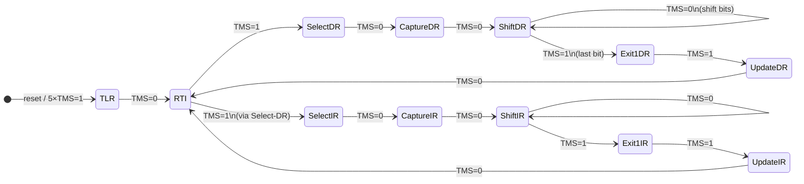

# BSCANE2 user_* protocol — port notes

This document describes the JTAG-side protocol the recovery FPGA bitstream
exposes, and the subtle TAP-state-machine constraint that the upstream
[`recover.py`][upstream] handles implicitly via pyftdi's API but had to be
preserved explicitly when porting to Pi GPIO bit-banging.

[upstream]: https://github.com/GideonZ/1541ultimate/blob/master/recovery/u64ii/recover.py

## Architecture

The recovery bitstream contains a Xilinx **BSCANE2** primitive wired up to
a custom JTAG-AXI bridge. BSCANE2 lets the FPGA design hook into the
device's JTAG TAP via the standard USER1-USER4 instructions.

This bridge uses **USER4** (`IR=0x23` for the Artix-7 XC7A50T's 6-bit IR).
When USER4 is selected, the bridge's own internal logic gets connected to
the TAP's TDI/TDO and DR shift register.

### Bridge internal IR

Within USER4, the bridge has its own 5-bit "user IR" register that
selects which of several internal data paths gets connected to the next
DR shift. The register set (from `recover.py`):

| User IR | Function |
|---|---|
| `0` | Read 32-bit user-side IDCODE (returns `0xdead1541` once the recovery RISC-V firmware is running) |
| `2` | 8-bit GPIO output register (bit 7 = RISC-V CPU reset; 0x80 = reset, 0x00 = run) |
| `5` | 10-byte memory-write address command |
| `6` | Streaming data write (bytes go to the address set up by IR=5) |

### Mode bit

Each DR transaction in USER4 mode is prefixed by a single "mode bit":

- **`'1'`** — what follows is the **bridge IR** (selects which sub-register, from the table above)
- **`'0'`** — what follows is **bridge data** (read from / write to the sub-register selected by the most recent IR)

So a typical operation is two phases:

1. **Set bridge IR**: shift `1`+5-bit-IR via DR, with the trailing IRSCAN
   USER4 wrappers (see below).
2. **Read or write data**: shift `0`+payload via DR.

## Operation sequences

### Setting the bridge IR (`set_user_ir(ir)`)

```
IRSCAN USER4              # connect bridge to TAP
DRSCAN 5 bits: ir<<1 | 1  # mode='1' (IR), payload = 5-bit ir; commits via Update-DR
IRSCAN USER4              # re-arm bridge
ENTER Shift-DR
SHIFT 1 bit: '0'          # mode='0' (data) — DO NOT exit Update-DR yet!
[stay in Shift-DR for the next operation, which shifts payload]
```

Critical: the trailing `'0'` mode bit and the next operation's payload
MUST be committed in **one single Update-DR transaction** — i.e. the
bridge must see one continuous DR shift containing the mode bit AND the
payload, then ONE Update-DR at the very end to latch them together.

If the mode bit gets committed alone (its own Update-DR), the bridge
processes "1-bit data write with value '0'" — meaningless — then on the
next operation sees a fresh DR shift with no mode prefix and protocol-
misaligns. Symptom: uploads complete silently with garbage, post-boot
bridge IDCODE is wrong (e.g. `0xbd5a2a83` from a desynced state machine
versus the correct `0xdead1541` signature).

### Reading 32-bit user IDCODE (`user_read_id`)

```
set_user_ir(0)            # leaves TAP in Shift-DR after '0' mode bit
SHIFT 32 bits: zeros      # exits via Exit1-DR + Update-DR; TDO captures payload
                           # (= the 32-bit user-IDCODE, e.g. 0xdead1541)
```

Total committed: 33 bits (1 mode + 32 data). One Update-DR at the end.

### Setting 8-bit GPIO outputs (`user_set_outputs`)

```
set_user_ir(2)            # leaves in Shift-DR after mode bit
SHIFT 8 bits: value       # exits via Exit1-DR + Update-DR
```

Bit 7 of `value` = RISC-V soft-core reset. `0x80` to assert reset, `0x00`
to release (and boot from DRAM).

### Memory write (`user_write_memory(addr, buf)`)

The write command is two phases:

```
# Phase 1: 10-byte address-setup command
set_user_ir(5)
SHIFT 10 bytes (80 bits) via Shift-DR; exit via Update-DR

  Command bytes (LSB-first within each byte):
    [addr_byte_0, 4, addr_byte_1, 5, addr_byte_2, 6, addr_byte_3, 7, 0x80, 0x01]

  The 4/5/6/7 markers and the 0x80/0x01 trailer are register-write tags
  internal to the bridge that latch the 32-bit address into a target-
  address register.

# Phase 2: streaming data
set_user_ir(6)
SHIFT len(buf)*8 bits via Shift-DR; exit via Update-DR
```

The bridge auto-increments its internal address as data streams in, so
each call writes a contiguous block.

`user_upload(filename, base_addr)` chunks at 16 KB per `user_write_memory`
call, padding each chunk with 8 zero bytes (matches upstream).

### Boot-magic write

After uploading `ultimate.bin` to DRAM at `0x30000`:

```
8-byte little-endian struct at DRAM 0xFFF8:
    +0:  uint32 = 0x00030000  (entry point)
    +4:  uint32 = 0x1571BABE  (boot signature)
```

The recovery FPGA's RISC-V boot ROM checks for `0x1571BABE` at `0xFFFC`
on release-from-reset; if found, it jumps to the address at `0xFFF8`.

## JTAG TAP state machine subset (the path that matters)

The bridge protocol uses only a small subset of the JTAG TAP state machine. Below is the relevant subgraph (full TAP has 16 states; we only touch ~10):



The trap with this protocol: each set_user_ir + payload combo must produce a **single** Update-DR (latching the entire mode-bit + payload to the bridge as one transaction). Naively wrapping `drscan` calls so each one exits to RTI gives you *two* Update-DRs — and the bridge desyncs.

## TAP state machine — the trap

The single-Update-DR semantic is the part that's non-obvious from
reading `recover.py` because pyftdi's API hides it via stateful
`change_state('shift_dr')` + `shift_register(...)` calls that
*deliberately* don't exit Shift-DR. When porting to a transport with
explicit IRSCAN/DRSCAN primitives that always exit (OpenOCD's `drscan`,
xc3sprog's `cable_jtag` API, naive Python bit-bang implementations),
you have to:

- Make the trailing `'0'` mode-bit shift in `set_user_ir` **stay in
  Shift-DR** (no TMS=1 on the last bit, no Exit1-DR, no Update-DR).
- Have the *next* operation start its DR shift in Shift-DR (skipping the
  Capture-DR transition that would otherwise reload the bridge's DR with
  a fresh-but-empty value).
- Only on the *final* bit of the payload, set TMS=1 so the TAP exits to
  Exit1-DR → Update-DR. That single Update-DR commits mode + payload to
  the bridge as one transaction.

In this codebase, that's encoded as:

- `JtagBitbang.drscan_int(value, n_bits, exit_to_rti=False)` — shifts
  bits in Shift-DR without exiting.
- `JtagBitbang.drscan_int(..., exit_to_rti=True)` from a state already
  in Shift-DR — continues shifting and exits.
- `U64iiRecovery.set_user_ir(ir)` ends with
  `drscan_int(0, 1, exit_to_rti=False)`.
- `U64iiRecovery.read_user_dr(n_bits)` calls
  `drscan_int(0, n_bits, exit_to_rti=True)`, which from Shift-DR just
  continues shifting.

Same pattern in `user_write_memory` and `user_set_outputs`.

## State-machine table (for porters)

| Operation | TAP state at entry | TAP state at exit |
|---|---|---|
| `irscan(USER4)` | RTI | RTI |
| `drscan_int(N bits, exit_to_rti=True)` | any | RTI |
| `drscan_int(N bits, exit_to_rti=False)` | any | Shift-DR |
| `drscan_bytes(N bytes, exit_to_rti=True)` | any | RTI |
| `set_user_ir(ir)` | RTI | **Shift-DR** (with mode bit '0' shifted, NOT yet committed) |
| `read_user_dr(N)` | Shift-DR (post-set_user_ir) | RTI |
| `user_set_outputs(v)` | RTI | RTI |
| `user_write_memory(addr, buf)` | RTI | RTI |
| `user_upload(file, addr)` | RTI | RTI |

## Refs

- Upstream recovery script: <https://github.com/GideonZ/1541ultimate/blob/master/recovery/u64ii/recover.py>
- Upstream recovery README: <https://github.com/GideonZ/1541ultimate/blob/master/recovery/u64ii/README.md>
- Xilinx UG470 (7 Series Configuration), Chapter 6 — BSCAN/BSCANE2
- LinuxJedi's 2025 Pi-JTAG guide: <https://linuxjedi.co.uk/raspberry-pi-jtag-programming-2025-edition/>
- Issue #537 — Gideon's recovery design context: <https://github.com/GideonZ/1541ultimate/issues/537>
